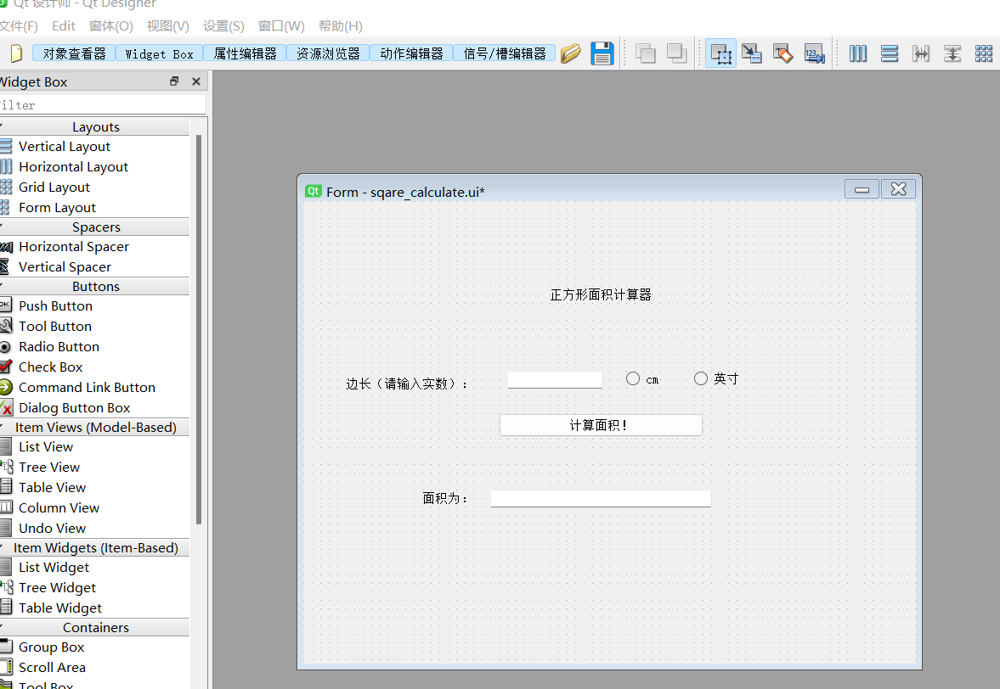

# 关于图形面积计算器的实现
## 1. 大致实现思路
我们利用PyQt5中的图形化库，设计处理程序的可视化界面；然后我们利用信号与槽的关联方法
实现页面的跳转；然后我们为按钮的点击信号设计对应的槽与内部逻辑处理。我们充分关注了对于
输入条件的边界值的测试，例如：当输入不为数字，或者无输入时可以得到对应的提示文件。同时
我们设计了两种单位的选择模式，可以自由切换。然后我们也对于本项目进行了代码单元测试。

## 2. 具体的实现过程：
+ 利用PYQT5的拖拽辅助设计来设计交互页面



然后利用代码转换工具生成代码，并对于图片中的组件位置参数进行调整。

+ 设计跳转页面的信号与槽的关联方法
```python
 #翻页操作
    ui0.pushButton.clicked.connect(partial(MainWindow.show, ))
    ui0.pushButton_1.clicked.connect(partial(SecWindow.show, ))
    ui0.pushButton_2.clicked.connect(partial(ThWindow.show, ))
    ui0.pushButton_3.clicked.connect(partial(FoWindow.show, ))

```
这里定义了菜单到各个页面的翻页操作。

+ 对于菜单类和每一个图形计算框定义一个类
```python
#第四个界面（三角形）的类：
class Ui_Form5(object):
    def setupUi(self, Form):
        Form.setObjectName("Form")
        Form.resize(721, 545)
        self.pushButton = QtWidgets.QPushButton(Form)
        self.pushButton.setGeometry(QtCore.QRect(230, 250, 241, 28))
        self.pushButton.setObjectName("pushButton")

        self.label = QtWidgets.QLabel(Form)
        self.label.setGeometry(QtCore.QRect(280, 30, 181, 101))
        self.label.setObjectName("label")

        self.label_2 = QtWidgets.QLabel(Form)
        self.label_2.setGeometry(QtCore.QRect(50, 200, 241, 31))
        self.label_2.setObjectName("label_2")

        self.label_4 = QtWidgets.QLabel(Form)
        self.label_4.setGeometry(QtCore.QRect(50, 150, 241, 31))
        self.label_4.setObjectName("label_4")

        self.label_5 = QtWidgets.QLabel(Form)
        self.label_5.setGeometry(QtCore.QRect(50, 100, 241, 31))
        self.label_5.setObjectName("label_4")

        self.lineEdit = QtWidgets.QLineEdit(Form)
        self.lineEdit.setGeometry(QtCore.QRect(230, 200, 113, 21))
        self.lineEdit.setObjectName("lineEdit")

        self.lineEdit_2 = QtWidgets.QLineEdit(Form)
        self.lineEdit_2.setGeometry(QtCore.QRect(230, 150, 113, 21))
        self.lineEdit_2.setObjectName("lineEdit")

        self.lineEdit_4 = QtWidgets.QLineEdit(Form)
        self.lineEdit_4.setGeometry(QtCore.QRect(230, 100, 113, 21))
        self.lineEdit_4.setObjectName("lineEdit")

        self.label_3 = QtWidgets.QLabel(Form)
        self.label_3.setGeometry(QtCore.QRect(80, 340, 121, 20))
        self.label_3.setObjectName("label_3")

        self.lineEdit_3 = QtWidgets.QLineEdit(Form)
        self.lineEdit_3.setGeometry(QtCore.QRect(250, 340, 261, 21))
        self.lineEdit_3.setObjectName("lineEdit_3")

        self.radioButton = QtWidgets.QRadioButton(Form)
        self.radioButton.setGeometry(QtCore.QRect(380, 200, 115, 19))
        self.radioButton.setObjectName("radioButton")

        self.radioButton_2 = QtWidgets.QRadioButton(Form)
        self.radioButton_2.setGeometry(QtCore.QRect(510, 200, 115, 19))
        self.radioButton_2.setObjectName("radioButton_2")

        self.retranslateUi(Form)
        QtCore.QMetaObject.connectSlotsByName(Form)

    def retranslateUi(self, Form):
        _translate = QtCore.QCoreApplication.translate
        Form.setWindowTitle(_translate("Form", "Form"))
        self.pushButton.setText(_translate("Form", "计算面积！"))
        self.label.setText(_translate("Form", "三角形面积计算器"))
        self.label_2.setText(_translate("Form", "第三条边（请输入正实数）："))
        self.label_4.setText(_translate("Form", "第二条边（请输入正实数）："))
        self.label_5.setText(_translate("Form", "第一条边（请输入正实数）："))
        self.label_3.setText(_translate("Form", "面积为(平方厘米)："))
        self.radioButton.setText(_translate("Form", "cm"))
        self.radioButton_2.setText(_translate("Form", "英寸"))
```
这里定义了三角形面积计算窗口的类，其中的属性就是窗口内的各个组件，而窗口的方法就是setUpui
和retranslateUi，然后对于每个组件属性赋值，包括位置与名称。

+ 关于数据的处理与计算逻辑：
我们让点击某个Button组件的信号可以实现数据的处理。
```python
#三角型处理函数
def Tri_comvert(ui):
    input_1 = ui.lineEdit.text()
    input_2 = ui.lineEdit_2.text()
    input_4 = ui.lineEdit_4.text()
    # 计算面积
    if input_1!=''and input_2!=''and input_4!=''and is_number(input_1)==1 and is_number(input_2)==1 and is_number(input_4)==1 and float(input_1)>=0 and float(input_2)>=0 and float(input_4)>=0:
        a = float(input_1)
        b = float(input_2)
        c = float(input_4)
        s = (a + b + c) / 2
        if a+b > c and a+c > b and b+c > a:
            result = math.sqrt(s * (s - a) * (s - b) * (s - c))
            if ui.radioButton.isChecked() == True:
               result = float(input_1)
               result = format(1 * result * result * math.pi, '.3f')
            if ui.radioButton_2.isChecked() == True:
               result = float(input_1)
               result = format(2.54 * 2.54 * result * result * math.pi, '.3f')
        else:
            result='输入不构成三角形，重新输入！'
    else:
        result='请输入完整合理数据！'
    ui.lineEdit_3.setText(str(result))

```
其中包括对于用户错误操作的提示以及处理逻辑。当然，我们尤其注重对于边界值的判定与检验，
保证我们的窗口不会因为用户的违规操作而崩溃。

## 3.需要配置的python软件包
软件中包的引用如下：
```python
import sys
from PyQt5.QtWidgets import QApplication, QMainWindow
from functools import partial
import PyQt5.QtCore
from PyQt5 import QtCore, QtGui, QtWidgets
import math
```
图形面积计算器的主函数是：sqare_calculate.py

单元测试代码：test.py

井字棋的主函数是：main.py

历史记录在：history.txt


## 4.代码单元测试
利用重载函数将原文件中的函数带入test.py中测试
```python
   #三角形的计算函数
    def test_Tri_comvert1(self):
        self.assertEqual(Tri_convert('e', 1,2,1, 0), '请输入完整合理数据！')
    def test_Tri_comvert2(self):
        self.assertEqual(Tri_convert('',1, 1, 0,1), '请输入完整合理数据！')
    def test_Tri_comvert3(self):
        self.assertEqual(Tri_convert(1,-1, 1,1, 0), '请输入完整合理数据！')
    def test_Tri_comvert4(self):
        self.assertEqual(Tri_convert(1,3, 1, 0,1),'输入不构成三角形，重新输入！' )
    def test_Tri_comvert5(self):
         self.assertEqual(Tri_convert(3,4,5, 1, 0),str(format(6, '.3f')) )
    def test_Tri_comvert6(self):
        self.assertEqual(Tri_convert(3, 4, 5, 0, 1), str(format(38.710, '.3f')))


```

## 5.小组分工
+ 软件的交互界面设计：张劭鹏
+ 软件计算功能逻辑：董佳俊
+ 软件的代码测试：张劭鹏，董佳俊，许冲，卜飞扬，王禹翔
+ README文档：张劭鹏

## 6.说明
本次作业的提交:[github地址](https://github.com/Zhang-shaop/calculating-about-area-of-graph)

组长：董佳俊 

联系邮箱：2640573106@qq.com

## 7.兴趣拓展
我们小组在学习了《pygame游戏开发实例》之后，也完成了井字棋小游戏的设计。
可以实现如下功能：
+ 选择人机对战或者好友对战
+ 可以选择先手
+ 每局结束之后可以记录历史对局步骤，保存至history文档中
+ 良好的用户交互界面

## 8.致谢
感谢助教和王老师一周的教授与答疑，感谢一起工作与学习的队友，感谢认真负责的队长董佳俊。

